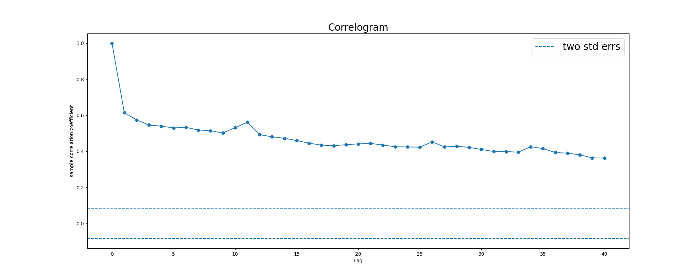
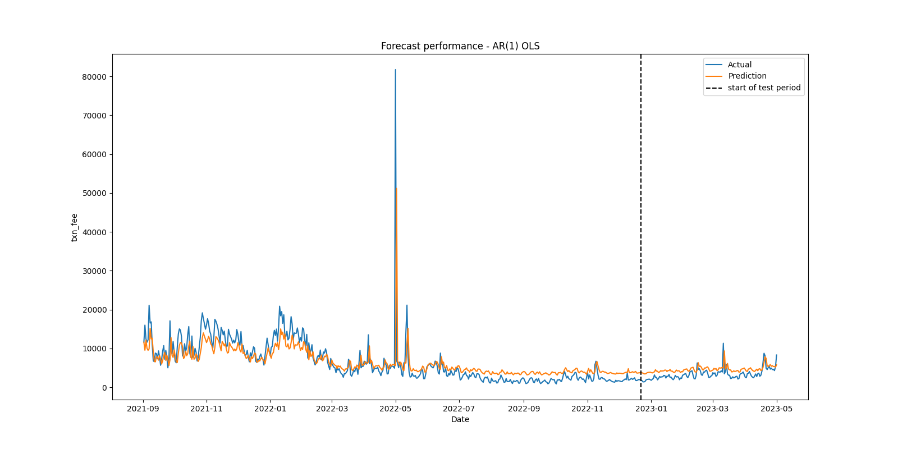
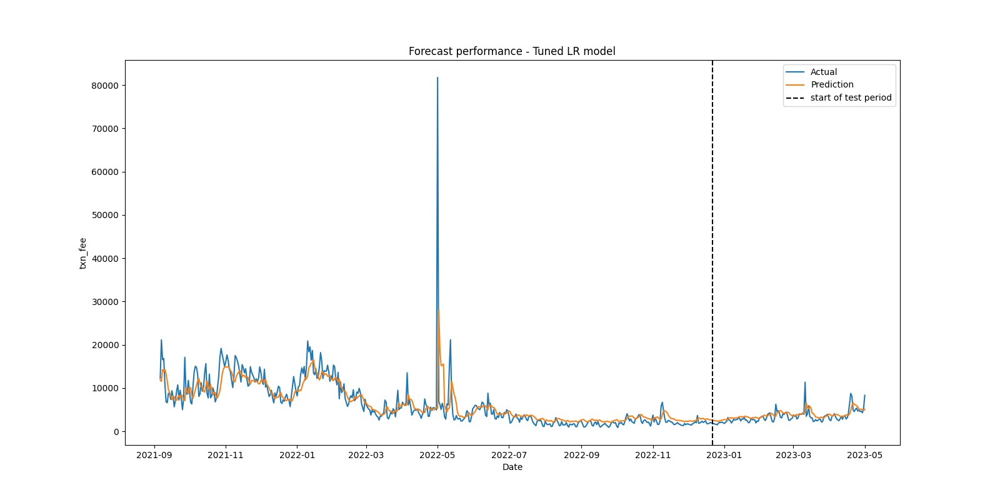
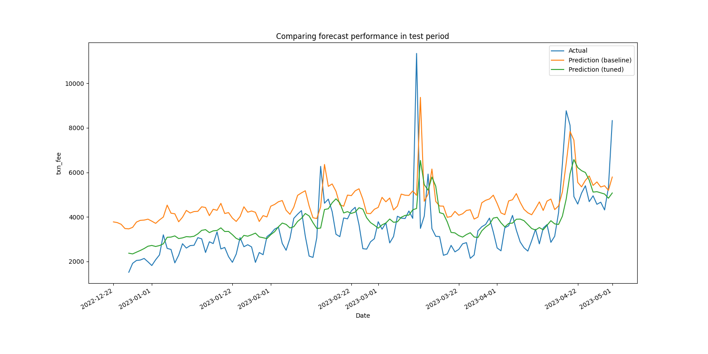

# Large-scale time series modeling of Ethereum transaction fees with AWS and PySpark
Author: Mingxuan (Ming) He  
Email:  mingxuanh@uchicago.edu

## Introduction

With the rising popularity of blockchain technologies and cryptocurrencies, there has been increasing interest from various social scientific disciplines to study the dynamics of blockchain ecosystems. As one of the core mechanisms of the blockchain economic system, transaction fee is a significant economic indicator, reflecting the supply and demand for block transactions and providing hints for the underlying costs and benefits of using cryptocurrencies as a medium of exchange. I choose Ethereum, the largest proof-of-stake blockchain today and the second largest overall, as the main subject of analysis.

Blockchain transactions data features both large volume and high velocity. Ethereum, for example, generates 7200 blocks documenting ~1 million new public transactions every day. Because of this big and always-on character, traditional social scientific methods are inadequate for analyzing this dataset.

**In this project, I build a large-scale computing and machine learning pipeline using AWS and PySpark to conduct time series modeling for transaction fees on the Ethereum blockchain**. Large-scale and cloud computing tools enable me to analyze this immense dataset in a timely and cost-effective manner. I use AWS's EMR clusters to provide scalable computing power, and the PySpark framework for leveraging distributed processing capabilities and reproducibility.

This project is a milestone towards my thesis research, which focuses on **dynamic economic modeling for optimal cryptoeconomic policies**. In particular, the time series model parameters estimated here will enter my calibration process for a larger model on the macro-cryptoeconomy, and help dynamically optimizing protocol policies in the form of staking and burning (more details on [my personal website](https://sites.google.com/view/mingxuanhe/projects?authuser=0#h.7d9csc2ft4uk)).

## Data

Blockchain transactions data is publicly available from many sources. I choose the [**AWS Public Blockchain Data**](https://registry.opendata.aws/aws-public-blockchain/) available in the AWS Public Data Catalog. One benefit of using this data source is its great integrability with AWS tools. All data is accessible as compressed parquet files stored in a public S3 bucket (`s3://aws-public-blockchain`), which can be read into Spark directly. In addition, the database allows for querying data on different blockchains (Bitcoin and Ethereum) under the same environment, which is often difficult for raw blockchain data.

The datasets are partitioned by date. I select data from 2021-09-01 (first month after implementation of [EIP-1559: fee market change](https://eips.ethereum.org/EIPS/eip-1559)) to 2023-05-01*.  
\* *Note: This period covers "the Merge".*

## Implementation details

### Packages Used
`pyspark (ml, sql), numpy, pandas, matplotlib, scipy, statsmodels, graphviz`  
For complete list of dependencies with version numbers see the *Spark Configuration* section of [Spark_EDA_TSTests.ipynb](Code/Spark_EDA_TSTests.ipynb)

### Part 1: Set up S3 and EMR Cluster: 
See [AWS_setup.ipynb](Code/AWS_setup.ipynb)  
* Initialize an EMR Cluster with 4 m5.xlarge EC2 instances and a S3 bucket for storage
* Configure the cluster to work with PySpark in the JupyterHub enviornment.

### Part 2: Exploratory analysis and time series tests: 
See [Spark_EDA_TSTests.ipynb](Code/Spark_EDA_TSTests.ipynb)  
* Preprocessing: Load data from parquet, compute transaction fees from gas and gas price
* Exploratory analysis: plotting time series for transaction fee and gas price
* Time series tests: stationarity test and serial correlation test (functions implemented in [time_series_tests.py](Code/time_series_tests.py))

### Part 3: Time series modeling pipeline with Spark ML: 
See [Spark_Pipeline_Modeling.ipynb](Code/Spark_Modeling_Pipeline.ipynb)

3.1 Build a custom pipeline for preprocessing & model estimation  
* Pipeline structure: see direct acyclic graph below. Contains 3 custom transformers and 3 transformer/estimators from `ml` library

* The model: $AR(p)$ model with non-zero mean:  
$\varphi_t = c + \Sigma_{j=1}^p \rho_j \cdot \varphi_{t-j} + \varepsilon_t,\quad \varepsilon_t \sim N(0,\sigma_\varepsilon^2),$  
where $\varphi_t$ 
: is the transaction fee (`txn_fee`) for a period $t$, and  
$\Theta:=\{(c,\rho_1,...,\rho_p, \sigma_\varepsilon^2): c\in\mathbb{R},\ \rho_j\in\mathbb{R} \ \forall\ 1\leq j\leq p,\ \sigma_\varepsilon>0\}$  
is the parameter space, with $\sigma_\varepsilon^2$ as a nuisance parameter.  

* Direct acyclic graph for the parameterized pipeline:  

3.2 Hyperparameter tuning with grid search  

Since Spark ML's `CrossValidation` and `TrainValidationSplit` executes random splitting which is not applicable to time series data, I built my own custom functions:
* `TimeSeriesSplit`: Custom index-based train-test split function suitable for time series data
* `LRTuning`: Custom grid search function for model evalation/tuning  

Hyperparmeters fixed: `maxIter=10`, `lags=20`  
Hyperparameters tuned: `regParam` $\lambda\in[0.01,0.1]$, `elasticNetParam` $\alpha\in\{0,1\}$  

3.3 Forecasting  
I run sample forecasts using the tuned hyperparameters, and compare the results with a baseline OLS model.

## Numerical results (more details in notebook)
### Time series plot: transaction fees by block and date

### Average gas price by date (in wei)

### Test for stationarity
Augmented Dickey-Fuller test results (frequency=daily):  
| Statistic | Value |
| --- | --- |
| ADF Statistic | -2.293400 |
| p-value | 0.174105 |
| Critical Value (1%) | -3.4423174665535385 |
| Critical Value (5%) | -2.866818952732754 |
| Critical Value (10%) | -2.569581505602171 |

### Test for serial correlation
Sample correlogram (frequency=daily)  

Ljung-Box Q test results (frequency=daily):
| Lag (*order*) | Ljung-Box Q Statistic | p-value |
| --- | --- | --- |
|   1   |   212.34017225797706  |   0.00    |
|   5   |   890.9232986158576   |   0.00    |
|   10  |   1661.1058361378193  |   0.00    |
|   20  |   2920.6317981596794  |   0.00    |
|   30  |   4003.365183837403   |   0.00    |

### Model training & forecasting:
Baseline model: AR(1) with OLS (frequency=daily)  
RMSE: 1673  
Model coeficients:  
| Coefficient | Value |
| --- | --- |
| $c$ | 2631.3209 |
| $\rho_1$ | 0.5940 |  

Tuned model: 5-lag Lasso model (frequency=daily)  
RMSE: 1210  
Hyperparameters: `regParam=0.01, elasticNetParam=1`  
Model coefficients:  
| Coefficient | Value |
| --- | --- |
| $c$ | 1033.6 |
| $\rho_1$ | 0.2953 |
| $\rho_2$ | 0.1669 |
| $\rho_3$ | 0.1208 |
| $\rho_4$ | 0.1256 |
| $\rho_5$ | 0.1240 |

A side-by-side comparison of the baseline OLS model and the tuned Lasso model:

## Future work

* Improving computational performance for conducting time series tests:  
Since the test functions were written to work with numpy arrays, currently the spark dataframes must be converted to pandas dataframes befor testing, resulting in performance slowdown, as well as memory insufficiency issues when aggregating on the block level. The solution might be to migrate the testing part to a Dask framework instead of Spark for better performance with numpy functions.
* Accounting for serial correlation in OLS estimation with Gordin's Central Limit Theorem:  
Since the sample exhibits serial correlation, it is more appropriate to estimate the asymptotic variance of the OLS estimator (therefore the standard errors) using the Gordin conditions (see Hayashi (2011) Ch. 6.5-6.6). This will require a new model class built up on PySpark's LinearRegression class, which is beyond the scope of this project. Spark's ML library does not provide a Generalized Method of Moments (GMM) estimator.
* Parallelize hyperparameter tuning function:  
Currently not a serious bottleneck since the grid size is small and functions within each loop are parallel, but might benefit from further parallelization similar to Spark's CrossValidator.

## References

* Ethereum Development Documentation. Gas and Fees. https://ethereum.org/en/developers/docs/gas
* Biais, B., Bisiere, C., Bouvard, M., Casamatta, C., & Menkveld, A. J. (2020). Equilibrium bitcoin pricing. The Journal of Finance. https://doi.org/10.1111/jofi.13206  
* Hayashi, F. (2011). Econometrics. Ch. 2.10, Testing for Serial Correlation. Princeton University Press.
* Hastie, T., Tibshirani, R., Friedman, J. H., & Friedman, J. H. (2009). The elements of statistical learning: data mining, inference, and prediction. Ch.3, Linear Methods for Regression. (Vol. 2, pp. 1-758). New York: springer.
* Registry of Open Data on AWS: AWS Public Blockchain Data. https://registry.opendata.aws/aws-public-blockchain/  
* AWS Public Blockchain Data: Bitcoin and Ethereum Blockchain Data. https://github.com/aws-solutions-library-samples/guidance-for-digital-assets-on-aws/tree/main/analytics
* Spark Machine Learning Library (MLlib) Guide. https://spark.apache.org/docs/latest/ml-guide.html
* Vinay Raman. Time-series forecasting using Spark ML: Part-2. https://medium.com/analytics-vidhya/time-series-forecasting-using-spark-ml-part-2-31506514c643
* Jay Luan. A Deep Dive into Custom Spark Transformers for Machine Learning Pipelines. https://www.crowdstrike.com/blog/deep-dive-into-custom-spark-transformers-for-machine-learning-pipelines/
* Learning Apache Spark with Python: Regularization. https://runawayhorse001.github.io/LearningApacheSpark/reg.html

## Miscellaneous

This project is submitted as the final project for MACS-30123 Large Scale Computing for the Social Sciences, taught by Prof. Jon Clindaniel at UChicago in Spring 2023. Huge thanks to Jon and the TAs for all the help related to class material and this project.